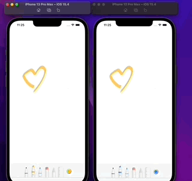
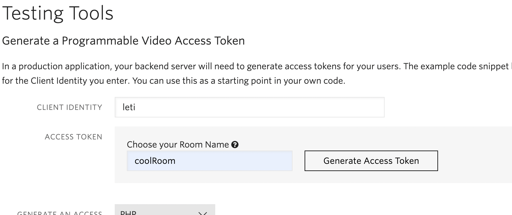

# BoardBlog

The idea is to implement a simple whiteboard that users can access from multiple devices. When any of the connected users draws on it, the others will immediately display the drawing.

We will build a collaborative whiteboard using PencilKit and Twilio Data Track!

# Tools used for for this project

## PencilKit
PencilKit provides a drawing environment for an iOS app that receives input from Apple Pencil or the user's finger and turns it into images you display in iPadOS, iOS, or macOS. 

## Twilio DataTrack
Twilio DataTrack is the mechanism/gateway that we are going to use to send the drawings, that the local participant has drawn, to the other users in order to share it in real time.

# Code

Twilio DataTrack it's a subcomponent of the TwilioVideo library so we need to add TwilioVideo library in the podfile in order to use TwilioData Track. 

```pod 'TwilioVideo', '4.6.2```

Roughly speaking the steps to implement the whiteboarding are the following:
- Setup Twilio data tracks and Connect to a Twilio room
- Setup PencilKit  
- Draw and send the drawings over data tracks
- Configure Twilio Data Tracks delegates to receive the drawings and setting it on the canvas

To tackle points 3. and 4. we basically need to do the following:

## Draw and send the drawings through data tracks

After setting up PencilKit the user will be able to draw (it’s that simple). Now, the thing is how are we going to manage to capture that drawing in order to be able to send it using LocalData Tracks. The answer is quite  simple, we capture the drawing through the delegate method `canvasViewDrawingDidChange`, as we show in the following code snippet:

```
extension WhiteboardViewController: PKCanvasViewDelegate, PKToolPickerObserver {
    /// Delegate method: Note that the drawing has changed.
    func canvasViewDrawingDidChange(_ canvasView: PKCanvasView) {
        guard !canvasView.drawing.bounds.isEmpty else { return }
                
            var dictionary = [String: Any]()
            dictionary["drawing"] = canvasView.drawing.base64EncodedString()
            send(dictionary, localDataTrack)
    }
}
```
`canvasViewDrawingDidChange` (belongs to the `PKCanvasViewDelegate`) -> Tells the delegate that the contents of the current drawing changed. In other words, this method will be triggered once the user lifts his finger or pencil. It’s at that moment we send the drawing as a base64 string in a dictionary via DataTrack. 

```
// Helper method that sends the drawing information as a jsonString using Twilio Data Track
    func send(_ dictionary: Dictionary<String, Any>,
                             _ localDrawingsDataTrack: LocalDataTrack?) {
        let tmp = dictionary.description.replacingOccurrences(of: "[", with: "{")
        let jsonString = tmp.replacingOccurrences(of: "]", with: "}")
        localDrawingsDataTrack?.send(jsonString)
    }
```

## Configure Twilio Data Tracks delegates to receive the drawings and setting it on the canvas

###### Listening for RemoteDataTrack events

The Twilio RemoteParticipant class provides a delegate protocol named `RemoteParticipantDelegate`. 

```
extension WhiteboardViewController: RemoteParticipantDelegate {
    func didSubscribeToDataTrack(dataTrack: RemoteDataTrack,
                                 publication: RemoteDataTrackPublication,
                                 participant: RemoteParticipant) {
        dataTrack.delegate = self
    }
}
```

###### Receiving Messages

You need to implement `RemoteDataTrackDelegate` to receive incoming messages on a DataTrack.

```
extension WhiteboardViewController: RemoteDataTrackDelegate {
    func remoteDataTrackDidReceiveString(remoteDataTrack: RemoteDataTrack, message: String) {
        if let data = message.data(using: .utf8) {
            processJsonData(remoteDataTrack, message: data)
        }
    }
    
    func processJsonData(_ remoteDataTrack: RemoteDataTrack, message: Data) {
        do {
            if let jsonDictionary = try JSONSerialization.jsonObject(with: message, options: []) as? [String: AnyObject] {
               
                if let drawing = jsonDictionary["drawing"] as? String {
                    guard let markupData = Data(base64Encoded: drawing) else { return }
                    
                    // Here we set the drawing get from the data      parameter
                    let pkDrawing = try PKDrawing(data: markupData)
                    // sets the incoming drawing on the canvas
                    canvasView.drawing = pkDrawing
                }
            }
        } catch {
            print("Error: processJsonData \(error)")
        }
    }
}
```

Note: 

The DataTrack API supports sending string as well as byte data. You can use [sendString](https://twilio.github.io/twilio-video-ios/docs/latest_3.x/Classes/TVILocalDataTrack.html#//api/name/sendString:) or [sendData](https://twilio.github.io/twilio-video-ios/docs/latest_3.x/Classes/TVILocalDataTrack.html#//api/name/sendData:) to send data to the Room. In this case we are sending the drawings as a jsonString, that’s why we implemented the `remoteDataTrackDidReceiveString`. 

## Need of needsToStoreOnDB flag 

Issue 👉 We noticed that after implementing the `remoteDataTrackDidReceiveString` method we ran into a circular reference problem. After a little while of digging into the issue we noticed that anytime the local participant would draw on the canvas, the method `canvasViewDrawingDidChange` was called. This method sends the drawing through the DataTrack. After sending it, since the local participant is listening to the DataTracks events as well, the  `remoteDataTrackDidReceiveString` method is invoked which also sets the received data (drawing) on the canvas by doing `canvasView.drawing = pkDrawing`. This line of code causes the `canvasViewDrawingDidChange` method to be executed (again), starting the cycle all over again.  

Solution 👉 To fix this issue `needsToStoreOnDB` flag comes into action. `needsToStoreOnDB` indicates whether the drawing should be sent through the DataTrack; we only send the drawing if it was drawn by the local participant. If it is a drawing that is coming from a remote participant we do not send it, only display it on the canvas.

```
extension WhiteboardViewController: PKCanvasViewDelegate, PKToolPickerObserver {
    /// Delegate method: Note that the drawing has changed.
    func canvasViewDrawingDidChange(_ canvasView: PKCanvasView) {
        guard !canvasView.drawing.bounds.isEmpty else { return }
                
        if needToStoreOnDB {
            var dictionary = [String: Any]()
            dictionary["drawing"] = canvasView.drawing.base64EncodedString()
            send(dictionary, localDataTrack)
        }
    }
    
    func canvasViewDidEndUsingTool(_ canvasView: PKCanvasView) {
        needToStoreOnDB = true
    }
}
```

And set `needToStoreOnDB` back to false:

```
extension WhiteboardViewController: RemoteDataTrackDelegate {
    func remoteDataTrackDidReceiveString(remoteDataTrack: RemoteDataTrack, message: String) {
        needToStoreOnDB = false
        if let data = message.data(using: .utf8) {
            processJsonData(remoteDataTrack, message: data)
        }
}
```

# Final result



## Extra/Disclaimer: 

To test the project out you need to generate a twilio access token and replace it on the accessToken variable on the `WhiteboardViewController`. Since each token is unique for each participant, if you would like to test it for two users (participants) you need to generate one access token, replace it on the code and run the app in one simulator, generate another access token and run the app again on a different simulator (or device). Don’t forget to change the Name (`CLIENT IDENTITY`) on the [Twilio Console](https://console.twilio.com/us1/develop/video/manage/video-credentials?frameUrl=%2Fconsole%2Fvideo%2Fproject%2Ftesting-tools%3Fx-target-region%3Dus1) and set a cool name for your room before generating the access token 😉. 



Reference: Please, refer to the [Apple official documentation](https://developer.apple.com/documentation/pencilkit) to read more about PencilKit and [Twilio official doc](https://www.twilio.com/docs/video/ios-v3-using-the-datatrack-api#configuring-datatrack-reliability) to learn more about Twilio DataTrack

